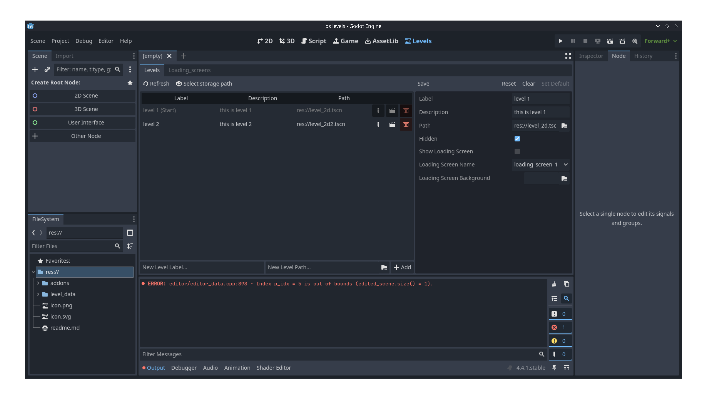

# D's Level Manager (Alpha 2.0)


A Level Manager built for the Godot Engine using GDScript. If you would like to contribute let me know at dmoreland117@gmail.com

Right now you need to press the refresh button after every edit to see changes.

## Freatures
* Level Management UI for adding, removing and editing Level info.
* Loading Screen management UI
* In game loading of levels via the Levels Singleton
* Can Automatically show Loading Screens while chaanging Levels.

## Ussage
1. Clone this repo
```bash
git clone https://github.com/dmoreland117/d-s-levels.git
```
2. Copy the addons/ds_levels into your projects addons folder
3. Open your godot project and enable the d's levels plugin
4. Go to the levels tab at the top of the editor (you will get some storage not found errors)
5. in the levels and loading screen tabs press the select storage button to choose the path the level and loading screen data will be stored in.
6. Add some levels and loading screens
7. in your game scene add a LevelContainer2D or 3D
8. Run the game and the first level in the list should load or to change to a specific level call:
```gdscript
Levels.change_to_level_name('Name', 'spawn_label)
```

## TODO
* Clean up code a bit
* Write docs
* Post a demo Video