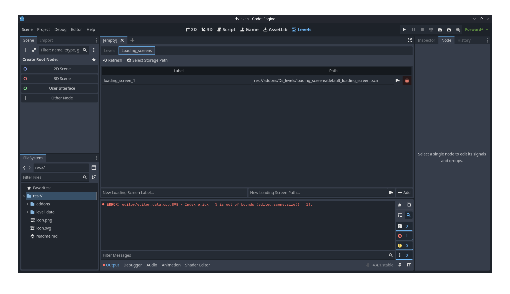

# D's Level Manager (Alpha 4.0)

Level Manager 
A WIP Level Manager built for the Godot Engine using GDScript. This Plugin is not ready for production Projects. If you would like to contribute let me know at dmoreland117@gmail.com


Level Manager 


Loading Screen Manager

## Freatures
* Level Management UI for adding, removing and editing Level info (Working).
* Loading Screen management UI (Working).
* In game loading of levels via the Levels Singleton (Working).
* Can Automatically show Loading Screens while chaanging Levels (Working).
* Level Transitions (Partly Working).

## Ussage
1. [Install the Plugin](https://github.com/dmoreland117/d-s-levels/wiki/Installation-Guide)
2. Go to the levels tab at the top of the editor (you will get some storage not found errors)
3. in the levels and loading screen tabs press the select storage button to choose the path the level and loading screen data will be stored in.
4. Add some levels and loading screens
5. in your game scene add a LevelContainer2D or 3D
6. Run the game and the first level in the list should load or to change to a specific level call:
    ```gdscript
    Levels.change_to_level_name('Name', 'spawn_label')
    ```

## TODO
To see a list of todos visit [the Isues Page](https://github.com/dmoreland117/d-s-levels/issues)