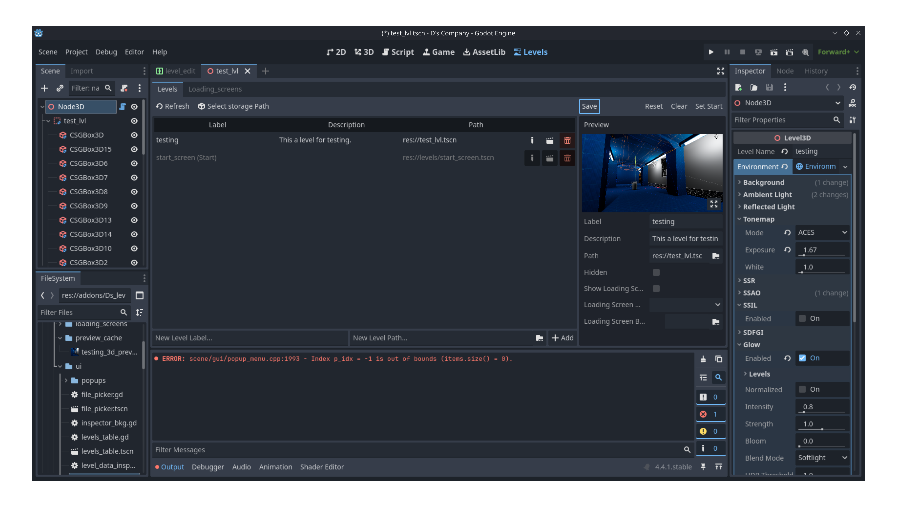

# D's Level Manager (Alpha 5.0)

Level Manager 
A WIP Level Manager built for the Godot Engine using GDScript. This Plugin is not ready for production Projects. If you would like to contribute let me know at dmoreland117@gmail.com


Level Manager 


Loading Screen Manager

## Freatures
* Level Management UI for adding, removing and editing Level info (Working).
* Loading Screen management UI (Working).
* In game loading of levels via the Levels Singleton (Working).
* Can Automatically show Loading Screens while chaanging Levels (Working).
* Level Transitions (Working).

## Ussage
1. [Install the Plugin](https://github.com/dmoreland117/d-s-levels/wiki/Installation-Guide)
2. Add some levels and loading screens
3. in your game scene add a LevelContainer2D or 3D
4. Run the game and the first level in the list should load or to change to a specific level call:
    ```gdscript
    Levels.change_to_level_name('Name', 'spawn_label', {'transition_name: 'fade'})
    ```

## TODO
To see a list of todos visit [the Isues Page](https://github.com/dmoreland117/d-s-levels/issues)